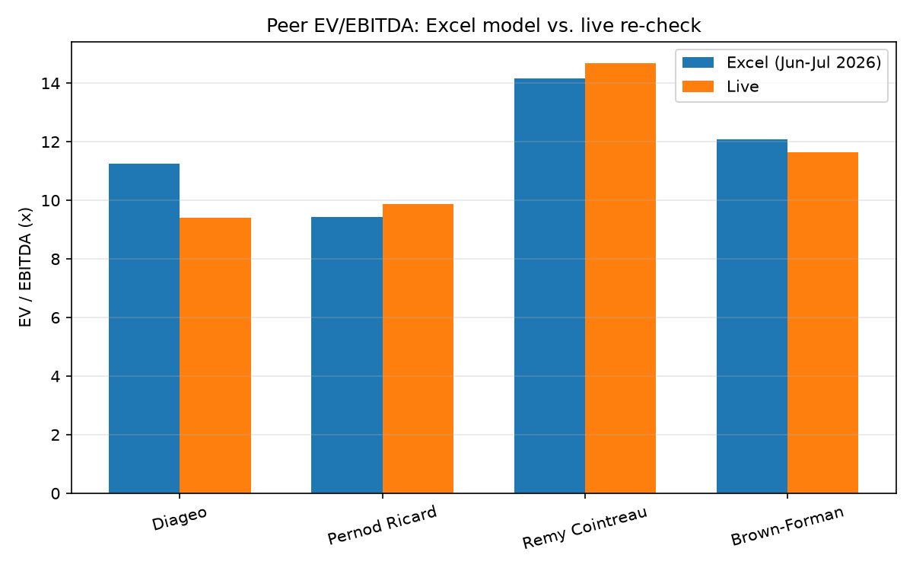

# Campari Group (BIT: CPR) — DCF & Trading Comparables Valuation


A full equity valuation of Davide Campari-Milano N.V., built in Excel with live formulas:
5-year FCFF forecast, WACC built from scratch, dual terminal value (Gordon growth and exit
EV/EBITDA), WACC × g sensitivity grid, trading comparables (Diageo, Pernod Ricard,
Rémy Cointreau, Brown-Forman) and a football-field summary.

**The Excel model is the deliverable** — the analytical judgment (forecast assumptions,
terminal value framing, investment view) lives there and in `RESEARCH_NOTE.md`. A small
Python package (`src/campari_valuation/`) sits alongside it with one job: pull live market
data and independently re-check the handful of the model's inputs that a live data source
can actually confirm or refute — peer trading multiples and beta. It does not re-do the DCF;
judgment inputs like the terminal growth rate or the equity risk premium have no live source
to check them against, and this project doesn't pretend otherwise.

*Author: Maria Sfondrini — Master in Finance, Peking University HSBC Business School;
B.Sc. Computer System Engineering, Politecnico di Milano.*

## Why this project exists

Most public "DCF in Excel" projects are a spreadsheet and nothing else: no way to tell
whether the market-observable inputs (peer multiples, beta) were reasonable on the day they
were typed in, and no way to re-check them later without redoing the research from scratch.
This project keeps the Excel model as the primary analytical deliverable — the forecast
judgment belongs there, made by a person, not automated — but adds a small, real Python
layer whose only job is to fetch live market data and independently re-derive the handful of
inputs a live source can actually confirm or refute. It found two genuine issues doing that
(see Live Validation below), which is the point: a validation layer that never disagrees
with the model it's checking isn't doing anything.

## Features

- **Excel DCF model**: 5-year FCFF forecast, WACC built up from its components, dual
  terminal value (Gordon growth and exit EV/EBITDA), a WACC × terminal-growth sensitivity
  grid, and a football-field valuation summary.
- **Trading comparables**: Diageo, Pernod Ricard, Rémy Cointreau, and Brown-Forman, with
  peer-median and peer-range implied valuations.
- **Live validation layer** (`src/campari_valuation/`): fetches current market data and
  independently re-derives beta (regression against two benchmarks, with the same Blume
  adjustment formula the Excel uses) and peer trading multiples (EV/EBITDA, EV/Sales, P/E,
  P/B), then reports how they compare to the Excel's stated assumptions.
- **Explicit data-quality handling**: detects and flags currency-unit inconsistencies in
  live vendor data (see the Diageo finding below) instead of silently trusting or "fixing"
  them with an unverified correction.
- Full pytest suite (unit + mocked-API + integration), ruff linting, GitHub Actions CI.

## Files

- `Campari_DCF_Model.xlsx` — the model. Blue cells = inputs, black = formulas.
  Tabs: README, Assumptions, DCF Model, Comps, Football Field.
- `RESEARCH_NOTE.md` — method, results, view, honest limitations, and the live-validation findings.
- `src/campari_valuation/` — the live-data validation layer (see below).

## Results

Headline DCF and comps outputs, market data as of early July 2026:

| Method | Implied price | vs €5.49 |
|---|---|---|
| DCF — Gordon growth | €9.75 | +78% |
| DCF — exit multiple (11.5x) | €6.79 | +24% |
| Trading comps — median (11.7x) | €6.00 | +9% |

Fair value triangulated at **€6.50–7.00**. The Gordon estimate is deliberately not the
headline: with terminal value at 85% of EV and a 3.5pp WACC−g spread, it is hypersensitive
to unobservable inputs — the note discusses why the multiple-based anchors are more
defensible.

## Live validation

Running `campari-valuation` fetches current data for Campari and its four comps (Diageo,
Pernod Ricard, Rémy Cointreau, Brown-Forman) and independently re-derives two things the
Excel model states as assumptions:

**1. Beta.** The Excel uses a vendor-reported raw beta of 0.43 (stockanalysis.com). This
package instead regresses Campari's own weekly returns against a market index — a genuine
independent re-derivation, not a re-statement of the same number. That regression turned up
a real finding: **the benchmark choice moves Campari's beta from 0.49 to 0.85** depending on
whether you regress against its home listing (FTSE MIB) or a broad pan-European index (STOXX
600) — a >70% swing from one modeling choice, at a fixed 2-year weekly-return window that is
otherwise held constant. The home-market beta (0.49) lands close to the Excel's 0.43; the
broad-index beta (0.85) does not. Reporting a single "the beta is X" would have hidden this.

**2. Peer trading multiples.** EV/EBITDA and P/E, recomputed live for all four comps. Three
of the four land within a few percent of the Excel's figures; Diageo is the outlier (live
9.4x EV/EBITDA vs. the Excel's 11.25x). Investigating why surfaced a genuine data-quality
issue, not a coding bug: **Yahoo Finance reports Diageo's price in pence but its EBITDA in a
different currency code, while still returning a plausibly-scaled market cap and enterprise
value** — an internally inconsistent combination of fields from a single API response. The
package detects and flags this (`currency_mismatch`) rather than silently trusting it or
guessing at an FX correction that could make things worse. See `RESEARCH_NOTE.md` for the
full write-up.

Sample output (`python -m campari_valuation.cli`):

```text
Campari (CPR.MI) live snapshot vs. Excel model (2026-07-02)
------------------------------------------------------------------------
Metric                                        Live             Excel
Share price (EUR)                             5.56              5.49
Raw beta vs FTSE MIB (home)                   0.49              0.43
Raw beta vs STOXX 600 (broad)                 0.84
Blume beta vs FTSE MIB (home)                 0.66              0.62
Blume beta vs STOXX 600 (broad)               0.89
Peer median EV/EBITDA                       10.76x            11.66x
Peer median P/E                             17.61x            14.09x
  (note: live P/E is trailing; Excel's is forward-looking - expect some gap)
Implied price @ peer EV/EBITDA                5.07               n/a

Peer trading multiples (live):
  Diageo             EV/EBITDA   9.41x   P/E   18.84x
  Pernod Ricard      EV/EBITDA   9.86x   P/E   11.51x
  Remy Cointreau     EV/EBITDA  14.69x   P/E   30.01x
  Brown-Forman       EV/EBITDA  11.65x   P/E   16.39x

CAUTION - currency mismatch between quoted price and reported financials for: DGE.L.
```

Also saves `results/peer_multiples_validation.png` (Excel vs. live EV/EBITDA by peer) and
`results/validation_metadata.json` (every live figure plus package versions, for
reproducibility).



## Installation

```bash
git clone https://github.com/sfondrinimaria02-del/campari-valuation.git
cd campari-valuation
python -m venv .venv
source .venv/Scripts/activate      # Windows (Git Bash); use .venv\Scripts\activate.bat for cmd.exe
# source .venv/bin/activate        # macOS/Linux
pip install -e ".[dev]"
```

## Usage

```bash
python -m campari_valuation.cli
```

## Testing

```bash
pytest --cov=campari_valuation --cov-report=term-missing   # unit tests, yfinance mocked
ruff check .
pytest -m integration                                       # hits the real Yahoo Finance API
```

Unit tests cover the pure multiples/beta math and the data layer's response parsing,
currency-unit handling, and retry logic (mocked at the API boundary — no network access, fast
enough for every push). `tests/test_integration.py` hits the real API to confirm the mocks
match reality, including a dedicated regression test for the Diageo currency-mismatch finding
above. GitHub Actions runs lint plus the full non-integration suite with coverage on every
push, across Python 3.11 and 3.12.

## Data sources

FY2025 results and balance sheet: Campari Group FY2025 press release (March 2026). Excel
market data and peer multiples: stockanalysis.com (July 2026). Risk-free: 10Y Bund
(TradingEconomics) — free live data has no clean equivalent for this specific series (see
`RESEARCH_NOTE.md`), so it is not part of the live validation. The Python layer's own live
figures come directly from Yahoo Finance at run time. All public information; academic
project, not investment advice.

## Roadmap

- A live cross-check for the risk-free rate: no free API currently offers a clean 10Y Bund
  yield series (see `RESEARCH_NOTE.md`), so this input stays Excel-only for now.
- Peer-average unlevered ("asset") beta as a cross-check to the regression-based equity beta.
- Sum-of-the-parts / brand-level analysis (Aperol, Campari, Espolòn, Wild Turkey, Courvoisier)
  — the current model values the group as a single cash-flow stream.
- Extend the live validation layer to a second company, to confirm the currency-unit and
  data-quality handling generalizes beyond this specific peer set.

## Disclaimer

This project is for research and educational purposes only. Nothing in this repository is
investment advice, and no result here should be construed as a recommendation to buy, sell,
or hold any security.

## License

[MIT](LICENSE)
